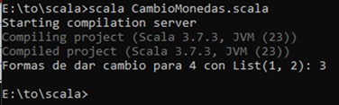
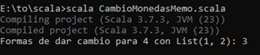

# Cambio de Monedas en Scala

Este proyecto implementa un programa en **Scala** que calcula el número
de formas posibles de dar cambio para una cantidad de dinero utilizando
una lista de monedas. Se ha desarrollado inicialmente con un enfoque
**funcional y recursivo**, y luego optimizado mediante **memoización**.

## 📌 Características

- Implementación básica recursiva.
- Versión optimizada con memoización para mejorar el rendimiento.
- Uso de estructuras inmutables y estilo funcional.

## 🚀 Ejecución

1. Instalar [Scala](https://www.scala-lang.org/download/).
2. Clonar o descargar este repositorio.
3. Ejecutar desde la terminal en la carpeta del proyecto:

```bash
scala CambioMonedas.scala
```

o bien la versión optimizada:

```bash
scala CambioMonedasMemo.scala
```

## 📂 Archivos principales

- `CambioMonedas.scala`: versión recursiva sin optimización.
- `CambioMonedasMemo.scala`: versión con memoización.

## 📸 Resultados

A continuación se muestran capturas de la ejecución de los ejercicios:

En esta salida, el programa calcula todas las combinaciones posibles de monedas de manera puramente recursiva, lo que implica repetir muchos cálculos intermedios. El resultado es correcto, pero el tiempo de ejecución crece rápidamente a medida que aumenta la cantidad a cambiar.

### Ejecución (versión recursiva)


Aquí se reutilizan los cálculos previamente almacenados en una tabla de memoria (memoización). Esto evita recomputaciones redundantes y hace que el programa sea mucho más rápido y eficiente, aunque entregue el mismo resultado final que la versión recursiva.

### Ejecución (versión con memoización)


## 📝 Conclusiones

- La programación funcional facilita expresar el problema de forma clara y matemática.
- La memoización reduce drásticamente los cálculos redundantes, mejorando la eficiencia.
- Un enfoque funcional con optimización ofrece código legible y rendimiento escalable.

---

✍️ Proyecto de ejemplo en Scala para comprender recursividad,
programación funcional y técnicas de optimización como la memoización.
