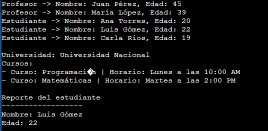
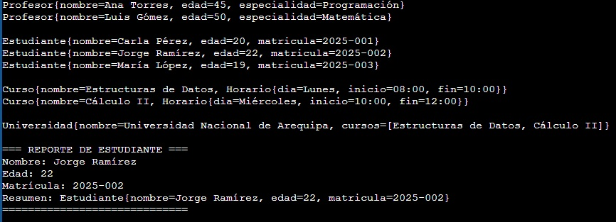

# Laboratorio 03 -- Programación Orientada a Objetos (Java y C++)

Este proyecto contiene dos implementaciones equivalentes de un sistema
académico simple, desarrollado en **Java** y en **C++**, para practicar
conceptos de **POO** como:

-   Herencia
-   Polimorfismo
-   Encapsulamiento
-   Composición
-   Agregación
-   Dependencia

------------------------------------------------------------------------

## 📂 Archivos incluidos

-   `lab03.java` → Implementación en **Java**
-   `main.cpp` → Implementación en **C++**
-   `lab03-java.jpg` → Captura de resultados de la versión Java
-   `lab03-c++.jpg` → Captura de resultados de la versión C++

------------------------------------------------------------------------

## ▶️ Compilación y ejecución

### Java

``` bash
# Compilar
javac lab03.java

# Ejecutar
java lab03
```

### C++

``` bash
# Compilar
g++ main.cpp -o main

# Ejecutar
./main
```

------------------------------------------------------------------------

## 📸 Resultados

### Ejecución en Java



### Ejecución en C++



------------------------------------------------------------------------

## 📌 Notas

-   Ambas versiones muestran entidades como **Profesor**,
    **Estudiante**, **Curso**, **Universidad** y **Reporte**.
-   Se ejemplifica:
    -   **Herencia** (Profesor y Estudiante heredan de Persona).
    -   **Composición** (Curso contiene un Horario).
    -   **Agregación** (Universidad contiene Cursos).
    -   **Dependencia** (Reporte genera información de un Estudiante).
-   Los resultados son equivalentes en ambos lenguajes, con diferencias
    propias de la sintaxis de Java y C++.

------------------------------------------------------------------------

✍️ Autor: *\[Tu nombre aquí\]*
